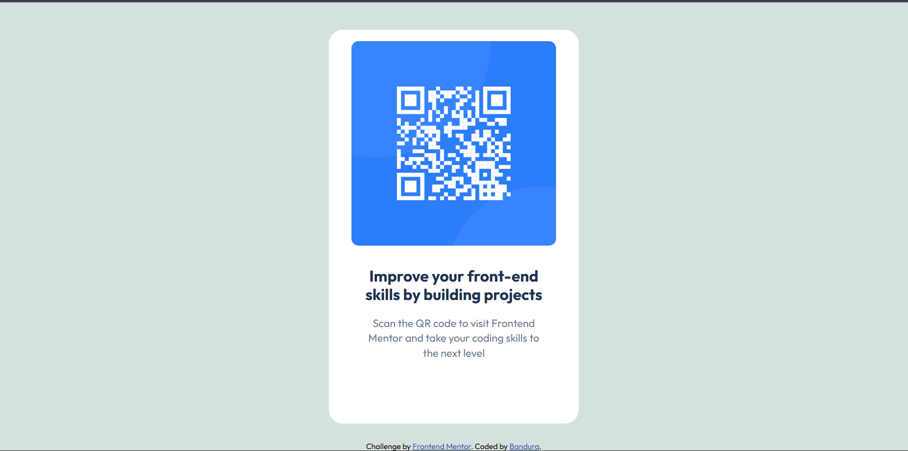

# Frontend Mentor - QR code component solution

This is a solution to the [QR code component challenge on Frontend Mentor](https://www.frontendmentor.io/challenges/qr-code-component-iux_sIO_H). Frontend Mentor challenges help you improve your coding skills by building realistic projects. 

## Table of contents

- [Overview](#overview)
  - [Screenshot](#screenshot)
  - [Links](#links)
- [My process](#my-process)
  - [Built with](#built-with)
  - [What I learned](#what-i-learned)
  - [Continued development](#continued-development)
  - [AI Collaboration](#ai-collaboration)
- [Author](#author)

## Overview

### Screenshot

### Links

- Solution URL: [https://github.com/AhmedDanjuma/FM-qr-code-component.git]
- Live Site URL: [https://bandura-qr-code-component-rho.vercel.app/]

## My process

### Built with

- Semantic HTML5 markup
- CSS custom properties
- Flexbox
- CSS Grid
- Mobile-first workflow

### What I learned

Let me recap the major concepts I've mastered:

**Foundational Skills:**
1. **Linking CSS to HTML** - Understanding file paths and connecting stylesheets
2. **CSS Syntax** - Writing rules with selectors, properties, and values
3. **Browser Defaults** - Learning that browsers add margin/padding to elements, and how to reset them using the universal selector `*`

**CSS Box Model:**
4. **Padding vs. Margin** - Understanding spacing inside (padding) vs. outside (margin) elements
5. **Padding Shorthand** - Mastering the top-right-bottom-left syntax

**Layout & Positioning:**
6. **Flexbox Basics** - Using `display: flex`, `justify-content: center`, and `align-items: center` to center content
7. **Fixed Positioning** - Making the footer stick to the bottom using `position: fixed`
8. **Structural HTML** - Creating wrapper divs for better styling organization

**Typography:**
9. **Google Fonts** - Importing custom fonts and understanding `@import`
10. **Font Properties** - `font-family`, `font-weight`, `font-size`, `line-height`

**Design Details:**
11. **Colors** - Using hex codes and understanding color values
12. **Border Radius** - Creating rounded corners
13. **Text Alignment** - Centering text content

**Professional Practices:**
14. **Comments** - Documenting code in HTML and CSS
15. **Responsive Design** - Thinking about scaling for different devices

### Continued development

**Layout & Positioning:**

### AI Collaboration

Describe how you used AI tools (if any) during this project. This helps demonstrate your ability to work effectively with AI assistants.

- Tools used (GitHub Copilot)
- I used Copilot for learning

## Author

- Frontend Mentor - [AhmedDanjuma](https://www.frontendmentor.io/profile/AhmedDanjuma)
- Twitter - [@AceBandura](https://x.com/AceBandura)